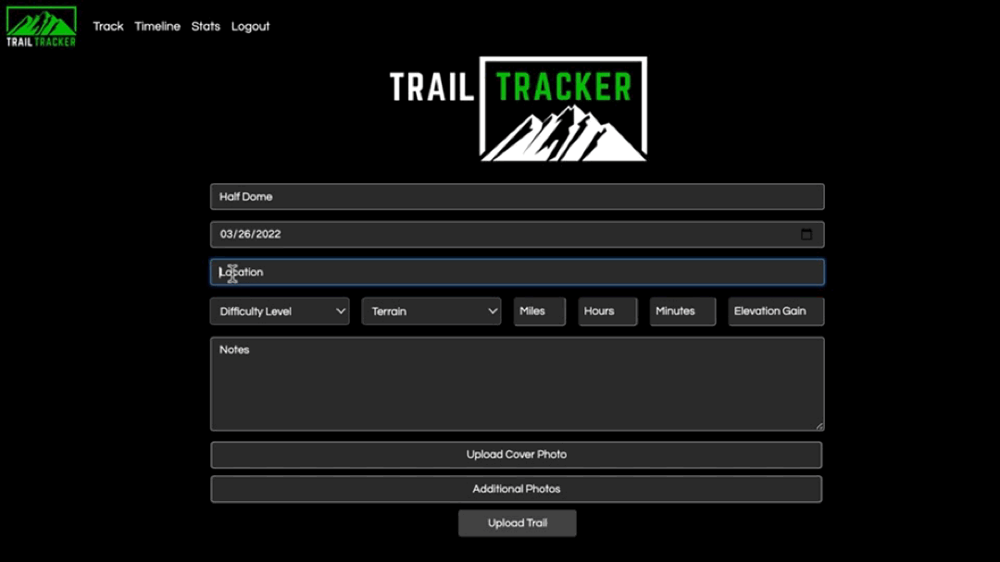

by [Sean Montgomery](https://www.linkedin.com/in/seandmontgomery/) | [seandmontgomery@gmail.com](mailto:seandmontgomery@gmail.com?subject=[GitHub]%20Trail_Tracker)

## <a name="#About"></a>What is Trail Tracker?

Trail Tracker is a web application for hikers. It allows users to store trail information from all of their favorite hikes as well as photos, videos and other media. Users can also view statistics and metrics on the app’s dashboard. My passion for software engineering, hiking, and photography lead me to build this application.


## Table of Contents

- [Tech Stack](#Tech)
- [Features](#Features)
- [Install](#Install)
- [Meet](#Meet)
- [Future](#Future)

## <a name="#Tech"></a>Tech Stack

- **Frontend**: JavaScript | HTML5 | CSS | Bootstrap
- **Backend**: Python3 | Flask | SQLAlchemy | Jinja2
- **APIs**: Cloudinary | GoogleMaps
- **Database**: PostgreSQL

## <a name="#Features"></a>Features

[Login](#Login) | [Upload](#Upload) | [Location Input](#Gmaps) | [Photo Upload](#Cloud) | [Timeline](#Timeline) | [Photo Album and Notes](#Photos) | [Location](#Location) | [Search](#Search) | [Statistics](#Statistics) | [Database](#Database) |

## <a name="#Login"></a>Login and Registration

A user gets started with Trail Tracker by creating an account. All that’s needed is an email address, first name, and a password. For security, I’ve stored all passwords using asymmetrical Sha-256 encryption.


## <a name="#Upload"></a>Upload

Upon successful registration, the user is taken to this comprehensive form designed to log all of the data from their hikes. The user starts by filling out the trail name, date and location. I provide the user an opportunity to track key metrics including: difficulty level, terrain, mileage, hours, minutes, and elevation gain. They also have the option to add any notes they may want to keep track of.


## <a name="#Gmaps"></a>Location Input

To collect the trail’s location data - I use the GoogleMaps API. Once the user starts typing a location name, GooglePlaces API with autocomplete handles the rest!



## <a name="#Cloud"></a>Photo Upload

By integrating Cloudinary’s media management API, I am able to offer the user the option to upload any number or type of media files. First, the user selects a photo they would like to be displayed as the cover photo for the trail. Then, they can add as many additional files as they would like, to populate their trail photo album. All of these images will be stored in the Cloudinary media library. The Cloudinary API returns a JSON response that includes each image’s URL which I extract and send to my database.


## <a name="#Timeline"></a>Timeline

After the form is successfully submitted, I bring the user to their trail timeline. A collection of cards which display all of the logged information. To develop a user-friendly interface, I styled Trail Tracker with Bootstrap and custom CSS, and used Jinja templating to dynamically display the trail data from the specific user in session.


## <a name="#Photos"></a>Photo Album and Notes

To allow the user to view their media and notes without being redirected, I built bootstrap modals to display only the data associated with that specific trail id. For example, only opening and displaying the Cloudinary photo URLs for that specific trail. To accomplish this, I built Javascript event listeners to invoke functions that make fetch requests to my flask routes. The response data is then used by the remaining methods in the event listener to manipulate the DOM.


## <a name="#Location"></a>Location Button

Clicking the location button will open up GoogleMaps and take the user to exactly where the trail is located.


## <a name="#Search"></a>Search

The cards are initially displayed in reverse chronological order with the most recent upload displayed first. To help the user quickly access specific trails, I developed a search feature by adding a JavaScript event listener that evaluates keystrokes and dynamically hides the cards that do not contain any text matching the query string. Once the user starts typing, all non-essential information disappears asynchronously and dynamically.


## <a name="#Statistics"></a>Statistics

Using Chart.js as a data visualization tool, I build statistical representations of trail types and difficulty. The first chart displays the amount of hikes the user has completed in a given terrain over all time. The second shows the total number of hikes they’ve completed at a particular difficulty level.


## <a name="#Database"></a>Database

I used SQLAlchemy as an ORM and Postgres as the database server.


## <a name="#Future"></a>Looking Ahead

I appreciate your interest in my project. Building this application taught me a great deal about database modeling, handling uploads asynchronously, multiple API integrations, and much more. Thank you for taking the time to learn a bit about Trail Tracker. I look forward to connecting with you!

## <a name="#Install"></a>Install

### Running Trail Tracker

1. Clone this repository:

```shell
git clone
```

**_Optional_**: Create and activate a virtual environment:

```shell
pip3 install virtualenv
virtualenv env
source env/bin/activate
```

2. Install dependencies:

```shell
pip3 install -r requirements.txt
```

3. Create environmental variables to hold your API keys in a `secrets.sh` file. You'll need to create your own Cloudinary API keys:

```
export cloud_name="create your own cloudindary name/account"
export cloud_api_key="once you do this they will provide you a key which you will put here"
export cloud_api_secret="use your own secret of course, shhh"
```

4. Create your database:

```shell
createdb trail_tracker
```

5. Run the app on localhost:

```shell
python3 main.py
```

## <a name="#Meet"></a>Meet the Developer

Hello! I'm Sean. My background in entertainment and education has lead me down a new creative path into tech. I am a skilled full stack web developer with a passion for multimedia presentation. I am proficient in the following technologies: Python, Javascript, AJAX, JSON, HTML, CSS, SQL, Flask, jQuery, Bootstrap, Jinja, SQLAlchemy, PostgreSQL, Command Line, Git, GitHub, and Agile. As a multimedia creator I am skilled in the following applications: Camtasia, Adobe Premiere Pro, iMovie, Garage Band, Descript, Snagit, and Canva. I have also had a successful 15 year career as a professional broadway actor in NYC. In my free time I enjoy mountain biking, hiking, snowboarding, running, cooking and international travel.

Connect with [Sean Montgomery](https://www.linkedin.com/in/seandmontgomery/) on LinkedIn!
